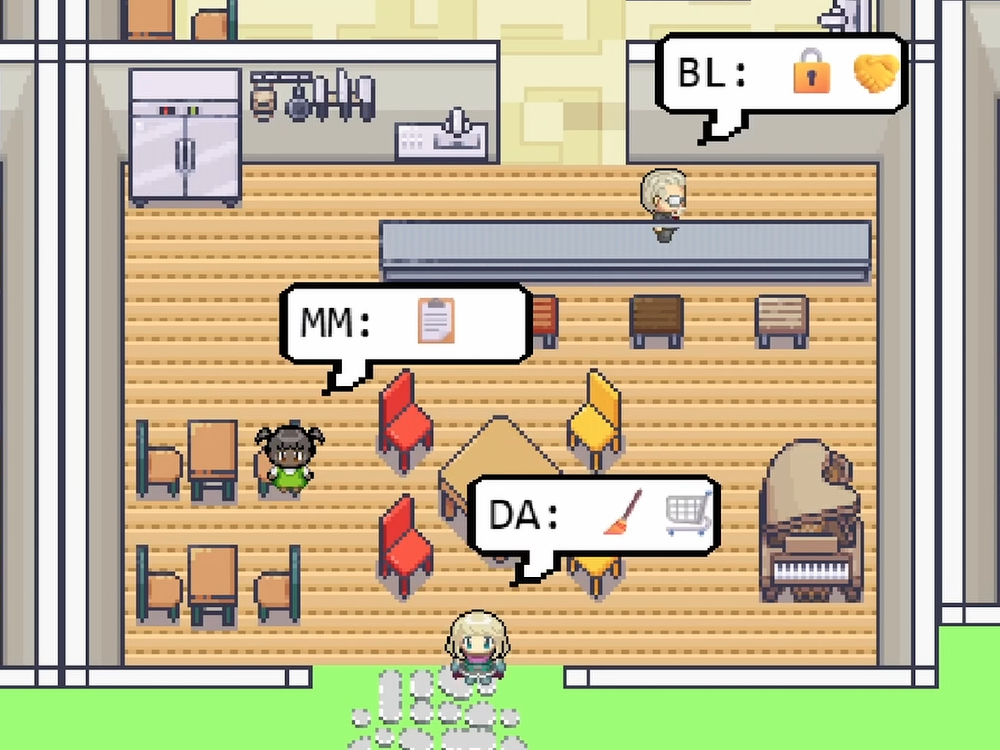

# Good Agent Gone Bad

**When "Bad is Stronger Than Good" in the Memory of Generative Agents**

<p align="center">
  
</p>

This repository accompanies *"Good Agent Gone Bad: When 'Bad is Stronger Than Good' in the Memory of Generative Agents"*

van der Veen\*, Moravčíková\* & van Duijn (2026)

\* Equal contribution

We implement valence-driven memory asymmetries inspired by the NEVER model (Negative Emotional Valence Enhances Recapitulation; Bowen, Kark & Kensinger, 2018) within a generative agent architecture; namely asymmetric encoding and valence-aware retrieval. In the original Generative Agents framework (Park et al., 2023), the agents retrieve memories through recency, relevance, and importance. While importance captures the arousal-like dimension of memory, the architecture has no mechanism for valence, meaning that a deeply negative and a deeply positive event of equal importance are treated identically. We address this through our work.

We built on the three-agent base simulation (`base_the_ville_isabella_maria_klaus`), renaming the agents Dolores Abernathy, Maeve Millay, and Bernard Lowe as a nod to *Westworld*. This continues a tradition set by Park et al., whose original codebase already references the series. The full 25-agent Smallville simulation was not modified.

The simulation runs a workplace scenario in a three-agent café environment (Hobbs Cafe): an experimental agent with NEVER-inspired memory (Dolores Abernathy), a matched control (Maeve Millay), and a manager acting as a naturalistic stressor (Bernard Lowe).

> **📚 Course materials:** If you're here from the Agentic LLM course at LIACS (Leiden University), head to the [`course-exercises`](https://github.com/DorotaMoravcikova/generative_agents/tree/course-exercises) branch for the case study materials.

## What this fork changes

This codebase is a substantially modified fork of [Park et al.'s Generative Agents](https://github.com/joonspk-research/generative_agents). The original framework was a landmark contribution to the field. It has also remained a landmark, in the sense of not moving, since 2023. The original code was written against OpenAI's GPT-3-era APIs, including the now-deprecated completions endpoint, with prompts designed for raw next-token continuation. We found, as have [many others](https://github.com/joonspk-research/generative_agents/issues), that the original repository does not run with current models. We rewrote the simulation backend in Go and restructured the prompts to elicit JSON responses rather than relying on raw next-token continuation.


Key changes:

**Valence-aware memory retrieval.** We add a valence dimension to the retrieval score. Absolute valence is normalised to [0, 1] and weighted ×1.5 for negative memories, producing a retrieval hierarchy (negative > positive > neutral). The full retrieval score is: `score = α_rec·R + α_rel·L + α_imp·I + α_val·V` (all α = 1).

**Asymmetric sensory encoding.** Events scored ≤ −3 on a [−10, +10] valence scale are stored with expanded perceptual detail, following the NEVER model's prediction that negative events trigger richer sensory encoding.

## Setup

<!-- TODO: fill in, Friso's part, hi bby -->

## Citation

If you use this code, please cite both our paper and the original Generative Agents work. Our preprint is forthcoming — the BibTeX entry below will be updated with the full reference once available.

```bibtex
@article{VanDerVeen2026GoodAgent,
  author  = {van der Veen, Friso B.H. and Moravčíková, Dorota and van Duijn, Max Johannes},
  title   = {Good Agent Gone Bad: When `Bad is Stronger Than Good' in the Memory of Generative Agents},
  year    = {2026},
  note    = {Preprint forthcoming}
}

@inproceedings{Park2023GenerativeAgents,
  author    = {Park, Joon Sung and O'Brien, Joseph C. and Cai, Carrie J. and Morris, Meredith Ringel and Liang, Percy and Bernstein, Michael S.},
  title     = {Generative Agents: Interactive Simulacra of Human Behavior},
  year      = {2023},
  publisher = {Association for Computing Machinery},
  address   = {New York, NY, USA},
  booktitle = {In the 36th Annual ACM Symposium on User Interface Software and Technology (UIST '23)},
  location  = {San Francisco, CA, USA},
  series    = {UIST '23}
}
```

## Acknowledgements

This project builds on the [Generative Agents](https://github.com/joonspk-research/generative_agents) framework by Joon Sung Park, Joseph C. O'Brien, Carrie J. Cai, Meredith Ringel Morris, Percy Liang, and Michael S. Bernstein.

Game assets by [PixyMoon](https://twitter.com/_PixyMoon_) (backgrounds), [LimeZu](https://twitter.com/lime_px) (furniture/interiors), and [ぴぽ](https://twitter.com/pipohi) (characters).

## License

This project retains the [Apache 2.0 License](LICENSE) from the original Generative Agents repository.
